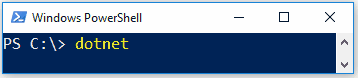

# posh-dotnet [](https://ci.appveyor.com/project/bergmeister/posh-dotnet/branch/master) [](https://ci.appveyor.com/project/bergmeister/posh-dotnet/build/tests) [](https://codecov.io/gh/bergmeister/posh-dotnet) [](http://google.com) [](https://www.gnu.org/licenses/gpl-3.0)

`PowerShell` tab completion for the [dotnet CLI](https://github.com/dotnet/cli).



## Installation

You can install it via the [PSGallery](https://www.powershellgallery.com/packages/posh-dotnet/)

````powershell
if ($PSVersionTable.PSVersion.Major -ge 5) {
    Install-Module posh-dotnet -Force
}
else {
    Install-Module TabExpansionPlusPlus -Force
    Install-Module posh-dotnet -Force
}
````

Alternatively you can also use it directly from this repo

````powershell
git clone https://github.com/bergmeister/posh-dotnet.git
cd .\posh-dotnet
Import-Module .\posh-dotnet.psd1
````

## Usage

````powershell
Import-Module posh-dotnet
````

It has been tested using the dotnet CLI version 1.0.3 and 2.0.3 on `Windows PowerShell 5.1` and `PowerShell Core 6.0 RC` but it should also work down to version 3.0 of `PowerShell`.
